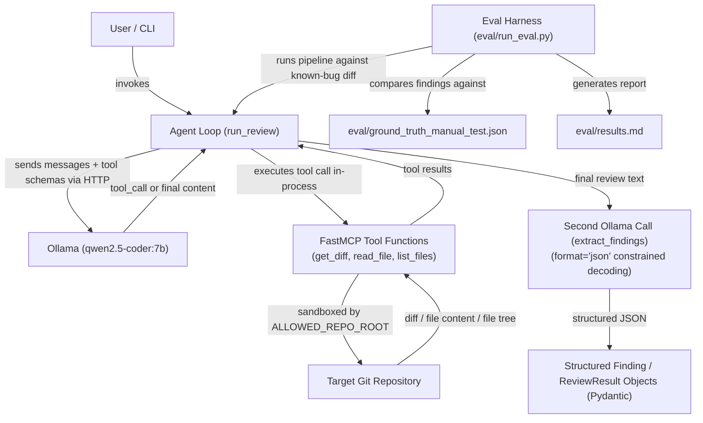

# Local Code Reviewer

A code review agent that runs entirely on local infrastructure (Ollama + `qwen2.5-coder:7b`), uses a hand-written MCP server (FastMCP) to give the model read-only access to a git repository (`get_diff`, `read_file`, `list_files`), and a hand-written agent loop (no LangChain/LangGraph) to orchestrate tool calls until a final review is produced. Built as a 3-day project to develop hands-on MCP/agent experience ahead of an AI Engineer interview.

## Architecture



## How to Run

### Prerequisites
- Python 3.11+
- [uv](https://github.com/astral-sh/uv)
- Ollama running locally with `qwen2.5-coder:7b` pulled:
  ```bash
  ollama pull qwen2.5-coder:7b
  ```

### Installation
```bash
uv sync
```

### Environment Setup
Set the required environment variable before running anything:
```bash
export ALLOWED_REPO_ROOT=/path/to/allowed/repos/parent/dir
```
> **Note:** The MCP server refuses to start without this environment variable set — it serves as the strict sandboxing boundary.

### Running a Review Manually
```bash
uv run python src/code_reviewer/agent.py
```
> **Note:** Currently the repository path, base ref, and head ref are hardcoded in the `__main__` block for testing. No CLI flag parsing was built yet (see "Future Work" below).

### Running the Evaluation Harness
Run the evaluation harness from the project root:
```bash
uv run python -m eval.run_eval
```
This runs the full pipeline 3 consecutive times against a small set of 3 manually-injected known bugs and writes `eval/results.md` with recall, precision, and false-positive numbers.

## Future Work
These items were explicitly scoped out under the 3-day project deadline:
- **No CLI (typer) with argument parsing:** base, head, and repo path are currently hardcoded for testing.
- **No RAG / vector search / codebase-wide context retrieval:** dropped and out of scope entirely for this pass.
- **No FastAPI service layer, no containers/Podman:** runs directly as a standalone Python process.
- **No Langfuse tracing, no LangGraph comparison, no Jenkins CI.**
- **Small evaluation sample size:** the eval harness uses 3 manually-injected bugs rather than the originally-planned 15–20 seeded-bug sample repository due to time constraints.
- **In-process MCP calls:** the MCP server is used in-process via FastMCP's direct Python function calls, rather than being spawned as a separate subprocess communicating over the real stdio MCP transport (a deliberate simplification, noted in `DECISIONS.md`).

---

See [DECISIONS.md](DECISIONS.md) for design rationale, trade-offs considered, and known limitations.
